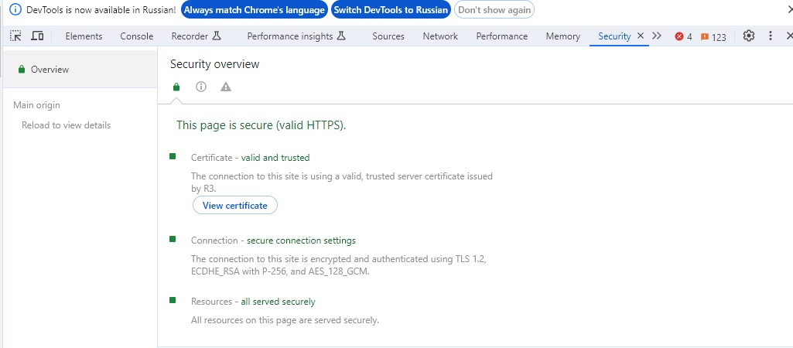
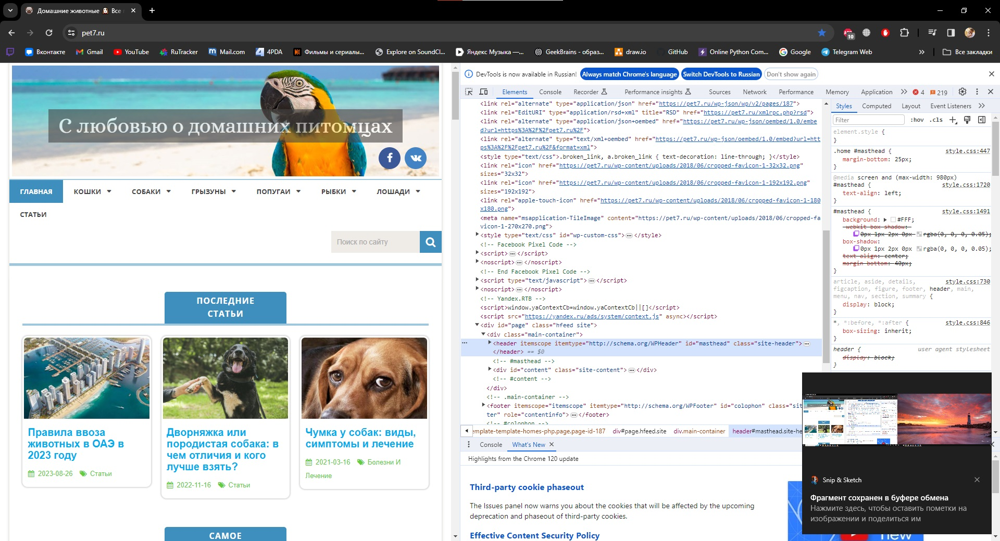
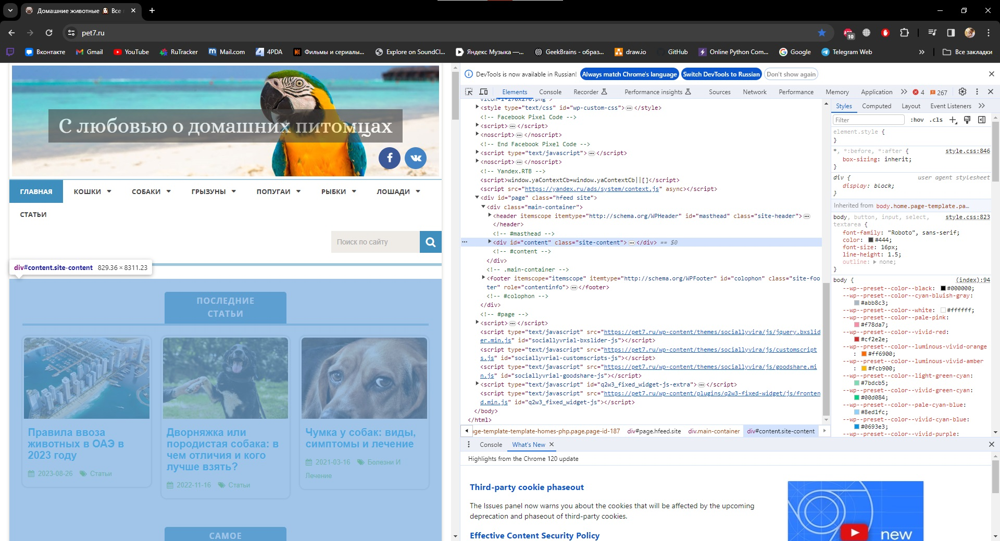
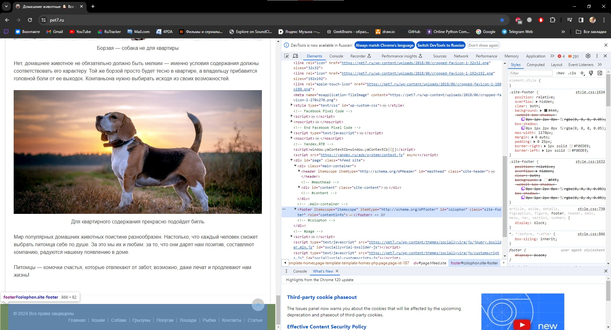
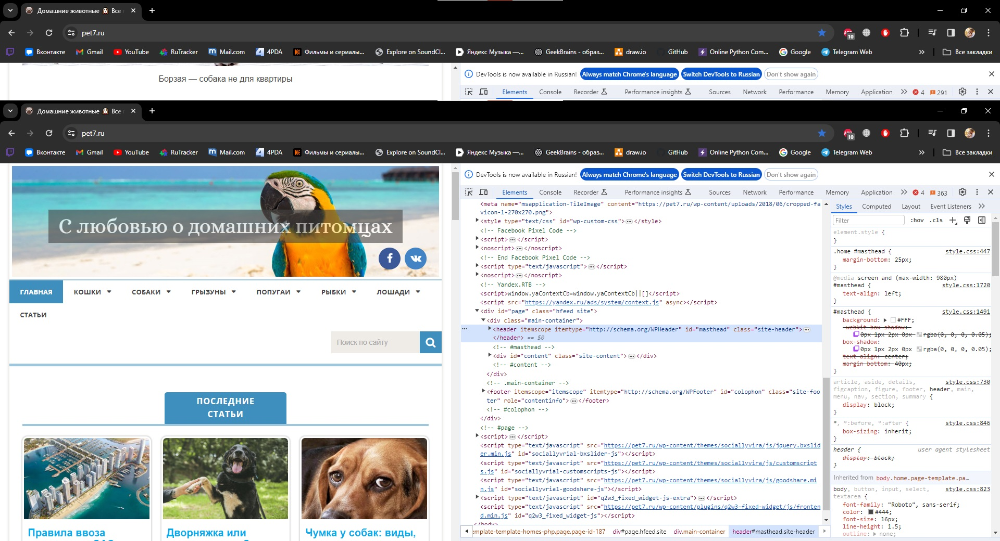
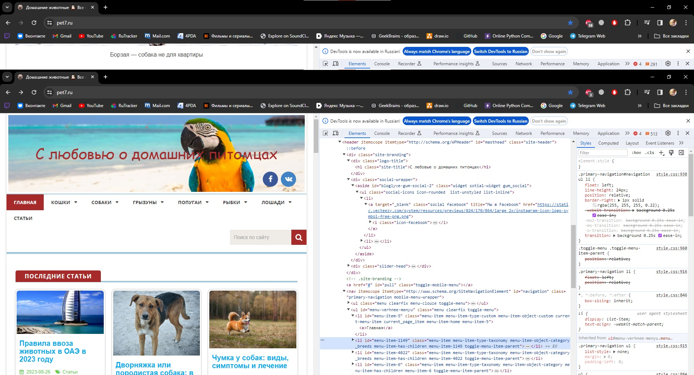
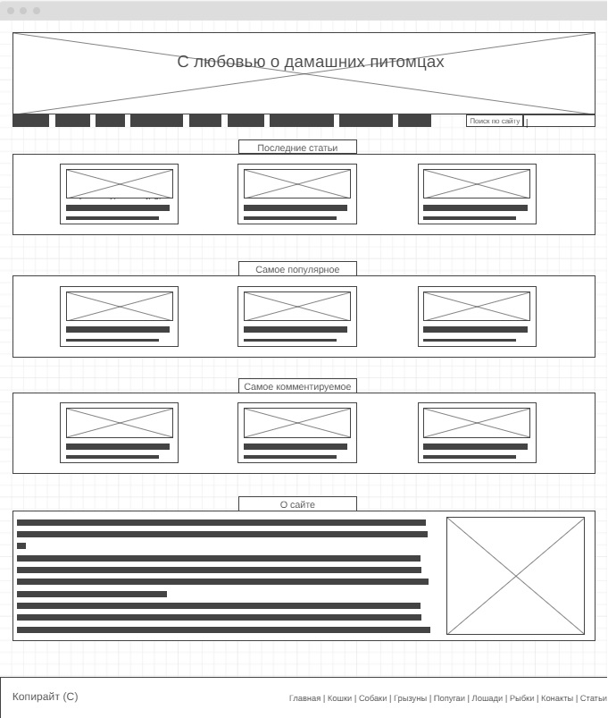

# Задание 1 по курсу знакомство с Веб-технологиями
## Задача: на основе сайта https://pet7.ru/
* Определите, на каком протоколе работает сайт.

Данный сайт работает на протоколе HTTPS

* Проанализируйте структуру страницы сайта. Покажите в коде где хедер, футер и контент.

Структура страницы:

Шапка страницы

Тело страницы/контент

Футер страницы

* Внесите не менее 3 изменений на страницу с помощью инструмента разработчика и представьте скриншоты было/стало.

Исходная страница

Изменил шрифт и цвет заголовка в шкапе, тип контейнера, цвета выделенных элементов, фото статей:

* Создайте прототип низкой детализации.

Прототип сайта низкой детализации, созданный с помощью wireframe
